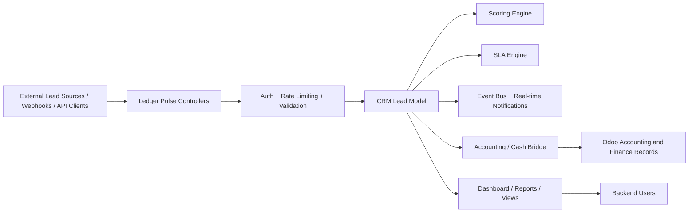

# Ledger Pulse

[](https://www.odoo.com/)
[](https://www.gnu.org/licenses/lgpl-3.0)
[](https://www.python.org/)
[](https://github.com/mmuneebazam/Ledger-Pulse)

<div align="center">

  

  <h3>CRM intelligence, SLA automation, and accounting bridge for Odoo</h3>

</div>

Ledger Pulse is a custom Odoo 17 addon designed to connect CRM workflows, sales intelligence, API-driven lead intake, and accounting operations in a single real-time module.

It provides a modern ledger-style operational layer for processing incoming leads, assigning scores, enforcing SLA policies, surfacing dashboard insights, and bridging CRM activity into accounting-related workflows.

## Overview

Ledger Pulse is built for businesses that want to:

- capture and validate leads through a REST API
- score incoming leads based on configurable rules
- track SLA deadlines and lead lifecycle state
- monitor events in real time through the Odoo bus system
- integrate CRM activity with accounting and cash flow workflows
- expose internal dashboards and reporting views inside Odoo

## Features

- CRM lead enrichment and scoring
- API versioning and secure key-based access
- Request logging and idempotency protection
- SLA tracking and policy-based lead handling
- Real-time bus notifications and frontend dashboard support
- Accounting / cash bridge workflows
- Odoo backend views and menu integration
- Cron-based automation and business rule execution

## Technical stack

- Odoo 17
- Python
- XML, JS, SCSS assets for backend UI support
- Odoo ORM models, controllers, services, and cron actions
- PostgreSQL-backed persistence

## Repository structure

```text
ledger_pulse/
├── __init__.py
├── __manifest__.py
├── controllers/
├── data/
├── models/
├── report/
├── security/
├── services/
├── static/
├── tests/
├── views/
├── README.md
└── .gitignore
```

## Requirements

- Odoo 17 community or enterprise
- Python dependencies from the Odoo environment
- PostgreSQL database configured for the Odoo instance
- The module is intended to be installed in the Odoo `custom_addons` directory

## Installation

1. Clone or copy the module into your Odoo `custom_addons` folder.
2. Update your Odoo addons path so it includes the custom addons directory.
3. Restart the Odoo server.
4. Update the app list.
5. Install the module named `LedgerPulse`.

Example:

```bash
git clone https://github.com/mmuneebazam/Ledger-Pulse.git
```

Then place the project in your Odoo addons path or symlink it into `custom_addons`.

## Architecture



## Full Odoo installation guide

### 1) Prepare the environment

Make sure your Odoo 17 instance is installed and running with a valid PostgreSQL database.

```bash
# Example folder layout
/opt/odoo17/
├── odoo/
├── addons/
├── custom_addons/
└── .venv/
```

### 2) Add the module to Odoo

Clone the repository into your Odoo custom addons directory:

```bash
git clone https://github.com/mmuneebazam/Ledger-Pulse.git /opt/odoo17/custom_addons/ledger_pulse
```

Then update your Odoo config file, for example `odoo.conf`:

```ini
addons_path = /opt/odoo17/odoo/addons,/opt/odoo17/addons,/opt/odoo17/custom_addons
```

### 3) Install Python dependencies

If your Odoo environment does not already include the needed Python packages, install them from your project environment:

```bash
pip install -r requirements.txt
```

### 4) Start the Odoo server

```bash
/opt/odoo17/odoo-bin -c /etc/odoo/odoo.conf
```

### 5) Install the module in Odoo

1. Log in to Odoo as a user with admin rights.
2. Open the Apps menu.
3. Click Update Apps List.
4. Search for `LedgerPulse`.
5. Click Install.

### 6) Initial configuration

After installation:

- open the Ledger Pulse settings/configuration area
- define the company-level configuration record
- set API keys and rates as needed
- configure scoring and SLA policies for your business rules

## Configuration

After installation:

- open the Ledger Pulse settings/configuration area
- define the company-level configuration record
- set API keys and rates as needed
- configure scoring and SLA policies for your business rules

## API usage

The module includes a REST-style API under the controller layer, with features such as:

- lead creation
- lead querying
- key-based authentication
- rate limiting
- request logs and idempotency protection

## Development notes

This project follows the standard Odoo addon layout:

- `models/` contains business logic and records
- `controllers/` contains HTTP endpoints
- `services/` contains reusable logic for auth, event bus, scoring, and SLA handling
- `views/` contains backend UI definitions
- `static/` is used for JS/XML/SCSS assets
- `data/` stores scheduled actions and base data

## License

This project is distributed under the LGPL-3 license as declared in the addon manifest.

## Author

Muneeb Azam

## Contributing

Contributions are welcome. Please open an issue or submit a pull request with a clear description of the change you are proposing.

## Support

For support, usage questions, or deployment guidance, contact the project maintainer or use the repository issues tracker.
